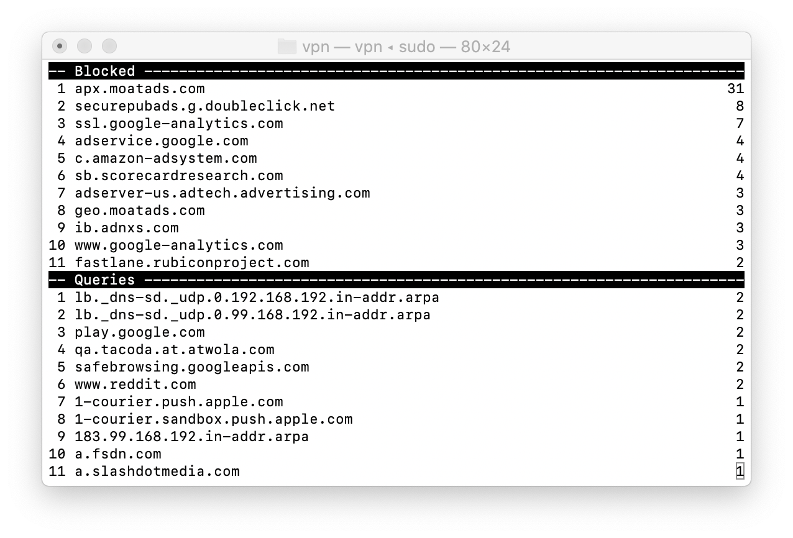

# vpn

Virtual Private Network for Everything. The VPN application implements
a "Virtual" Virtual Private Network i.e. there is no VPN server to
connect to. The VPN creates a tunnel device, and it consumes all IP
packets routed via the tunnel. This model allows to implement
application independent network filters, for example:

 * DNS-over-HTTPS service that does not depend on the DoH capabilities of the applications
 * Ad Blocking service that works without any browser plugins and extensions.

## DNS-over-HTTPS client

Start the vpn application with DoH URL. The current implementation is
a very early prototype supporting only `https://dns.google/dns-query`
with a big awkward syntax:

    $ sudo ./vpn -blacklist test.bl -doh https://8.8.8.8/dns-query -i

The proper DoH URL parsing will be implemented RSN.

## Ad Blocker

Start the vpn application with a domain blacklist file:

    $ sudo ./vpn -blaclist test.bl -i

The `-i` flag starts the application in interactive mode:

## DNS Server Configuration

### Query DNS Servers

    $ scutil --dns | grep nameserver

### Set DNS Servers

    $ networksetup -setdnsservers Wi-Fi 192.168.192.254
    $ networksetup -setdnsservers Wi-Fi 192.168.99.1

### Flush DNS Cache

This information is from [help.dreamhost.com](https://help.dreamhost.com/hc/en-us/articles/214981288-Flushing-your-DNS-cache-in-Mac-OS-X-and-Linux).

#### OSX 12 (Sierra) and later

    $ sudo killall -HUP mDNSResponder; sudo killall mDNSResponderHelper; sudo dscacheutil -flushcache

#### OS X 11 (El Capitan) and OS X 12 (Sierra)

    $ sudo killall -HUP mDNSResponder
